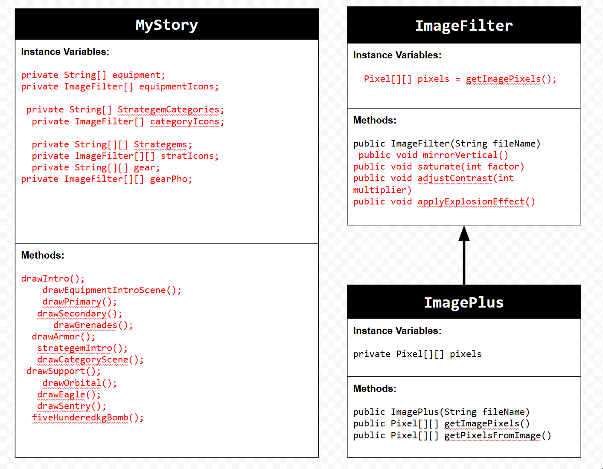

# Unit 4 - Personal Narrative

## Introduction

Images are often used to portray our personal experiences and interests. We also use image filters and effects to change or enhance the mood of an image. When combined into collages and presentations, these images tell a story about who we are and what is important to us. Your goal is to create a personal narrative using The Theater that consists of images of your personal experiences and/or interests, incorporates data related to these experiences and/or interests that can be organized in a 2D array, and uses image filters and effects to change or enhance the mood of your images.

## Requirements

Use your knowledge of object-oriented programming, two-dimensional (2D) arrays, and algorithms to create your personal narrative collage or animation:

- **Create at least two 2D arrays** – Create at least two 2D arrays to store the data that will make up your visualization.
- **Implement one or more algorithms** – Implement one or more algorithms that use loops and two-way or multi-selection statements with compound Boolean expressions to analyze the data.
- **Use Image Filters** - Include multiple image filters learned from this unit, and additionally create new ones of your own.
- **Use methods in the String class** – Use one or more methods in the String class in your program, such as to determine whether the name of an image file contains specific characters.
- **Create a visualization** – Create an image or animation that conveys the story of the data by illustrating the patterns or relationships in the data.
- **Document your code** – Use comments to explain the purpose of the methods and code segments and note any preconditions and postconditions.

## UML Diagram

## Video

(https://youtube.com/shorts/R_fQiGxkPBQ)

## Story Description

The story that my animation showcases is how to play Hell Divers 2. Hell Divers 2 is a shooter PVE game that I like to play and wanted to make the project about. The animation plays a series of photos and text that gives you important tools that your Hell Diver uses. This includes gear like you weapons or grenades and you stratagems which you call in to either do big amounts of damage or area control. The data that is represented in the 2D arrays are images and the names of the Hell Diver tools that the video is showing so you can see what tools a Hell Diver uses and what they look like.

## Image Filter Analysis
 
1 Filter that I used and created my self was the applyExplosionEffect() filter. This filter modifys the pixels by multiplying the RGB by r * 0.8; g * 0.6; and b * 0.3 in order to make the image orange and darker each time it is used to make it look like there is an explosion happening. To make it look better and not just a orange screen, the method also uses a if statement that takes a random number and change to add random particles around the screen that would intend to be smoke particles of an explosion.

A filter that I used from code.org was the mirrorVertical() filter. This filter traverses throughthe pixels but in the inner for loop when going through columns it divides the column pixels length by 2 because you only need the other half of the screen do to MIRRORING. It then makes a leftPixel variable and rightPixel variable so it could set the pixels of the leftPixel to be the ppixels of the rightPixel variable.
